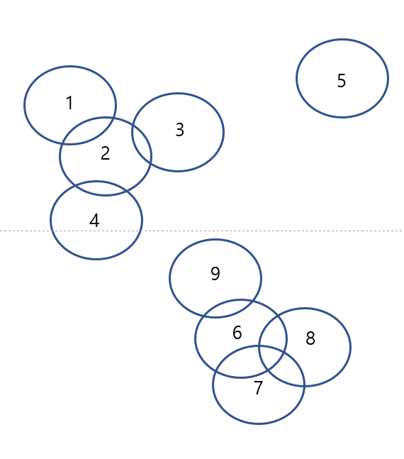

## grouping-with-groupset



### Version

```sql
SELECT VERSION();

+------------+
| VERSION()  |
+------------+
| 5.7.32-log |
+------------+
```

### DDL

```sql
CREATE TABLE `tb_driving` (
  `id` int(11) NOT NULL,
  PRIMARY KEY (`id`)
);

CREATE TABLE `tb_driven` (
  `fk` int(11) NOT NULL,
  `id` int(11) NOT NULL,
  KEY `tb_driven_ibfk_1` (`fk`),
  CONSTRAINT `tb_driven_ibfk_1` FOREIGN KEY (`fk`) REFERENCES `tb_driving` (`id`)
);
```

### DML

```sql
INSERT INTO tb_driving VALUES (1),(2),(3),(4),(5),(6),(7),(8),(9);
INSERT INTO tb_driven VALUES
 (1,2)
,(2,1)
,(2,3)
,(2,4)
,(3,2)
,(4,2)
,(5,5)
,(6,7)
,(6,8)
,(6,9)
,(7,6)
,(7,8)
,(8,6)
,(8,7)
,(9,6)
;
```

### SELECT : normal grouping

```sql
SELECT
    a.id a_id
    ,GROUP_CONCAT(DISTINCT b.id) b_ids
FROM
    tb_driving a
    INNER JOIN tb_driven b ON b.fk = a.id
GROUP BY
    a.id
;

+------+-------+
| a_id | b_ids |
+------+-------+
|    1 | 2     |
|    2 | 1,3,4 |
|    3 | 2     |
|    4 | 2     |
|    5 | 5     |
|    6 | 7,8,9 |
|    7 | 6,8   |
|    8 | 6,7   |
|    9 | 6     |
+------+-------+
```

### SELECT : grouping with groupset

```sql
SELECT
     tmp.a_id
    ,tmp.b_ids
    ,@idx := SUBSTRING(JSON_SEARCH(@arr, 'one', tmp.a_id), 2, INSTR(JSON_SEARCH(@arr, 'one', tmp.a_id), ']') - 1) idx
    ,JSON_EXTRACT(@arr, @idx) groupset
FROM
    (
    -- 2. ------------------------------------------------------------- make groupset from origin data
    SELECT
         grp.a_id
        ,(@val := CONCAT('"', grp.a_id, '"')) val
        ,(@idx := SUBSTRING(JSON_SEARCH(@arr, 'one', grp.a_id), 2, INSTR(JSON_SEARCH(@arr, 'one', grp.a_id), ']') - 1)) idx
        ,grp.b_ids
        ,SUBSTRING(CASE
            WHEN JSON_SEARCH(@arr, 'one', grp.a_id) IS NULL THEN
                @arr := JSON_ARRAY_INSERT(
                    @arr,
                    CONCAT('$[', JSON_LENGTH(@arr), ']'),
                    JSON_KEYS(REPLACE(REPLACE(REPLACE(
                        JSON_MERGE_PRESERVE(@val, grp.b_ids)
                    , '",', '":1,'), '"]', '":1}'), '[', '{'))
                )
            ELSE
                @arr := JSON_REPLACE(
                    @arr,
                    @idx,
                    JSON_KEYS(REPLACE(REPLACE(REPLACE(
                        JSON_MERGE_PRESERVE(JSON_EXTRACT(@arr, @idx), CONCAT(grp.b_ids))
                    , '",', '":1,'), '"]', '":1}'), '[', '{'))
                )
        END,0,0) obj_is
        -- ---------------------- debug fields
        -- ,@arr
        -- ,JSON_LENGTH(@arr) arr_len
        -- ---------------------- debug fields
    FROM
        (
        -- 1. ------------------------------------------------------------- origin data grouping
        SELECT
            a.id a_id
            -- ,GROUP_CONCAT(DISTINCT b.id ORDER BY b.id) b_ids
            ,JSON_ARRAYAGG(CONCAT(b.id)) b_ids
        FROM
            tb_driving a
            INNER JOIN tb_driven b ON b.fk = a.id
        GROUP BY
            a.id
        ) grp
        INNER JOIN (SELECT @arr := JSON_ARRAY(), @val := NULL, @idx := -1 FROM DUAL) o
    ) tmp
;

+------+-----------------+------+----------------------+
| a_id | b_ids           | idx  | groupset             |
+------+-----------------+------+----------------------+
|    1 | ["2"]           | $[0] | ["1", "2", "3", "4"] |
|    2 | ["1", "3", "4"] | $[0] | ["1", "2", "3", "4"] |
|    3 | ["2"]           | $[0] | ["1", "2", "3", "4"] |
|    4 | ["2"]           | $[0] | ["1", "2", "3", "4"] |
|    5 | ["5"]           | $[1] | ["5"]                |
|    6 | ["7", "8", "9"] | $[2] | ["6", "7", "8", "9"] |
|    7 | ["6", "8"]      | $[2] | ["6", "7", "8", "9"] |
|    8 | ["6", "7"]      | $[2] | ["6", "7", "8", "9"] |
|    9 | ["6"]           | $[2] | ["6", "7", "8", "9"] |
+------+-----------------+------+----------------------+
```
